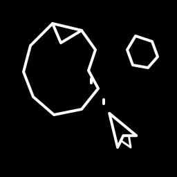

<div align="center">
  

  <h1>asteroidz</h1>

  <p>A fast, HDR-capable Wayland compositor for daily driving</p>

<a href="LICENSE"></a>

</div>

---

asteroidz is a wlroots compositor with a dwm-style tag model and a modern
rendering pipeline. It aims to be lean and fast while shipping the things a
desktop actually needs: real HDR, tasteful effects, and window management
that stays out of your way.

## Highlights

- **HDR & 10-bit output** — BT.2020 + PQ signalling with a 3D-LUT color
  resolve pass, ICC profile support, EDID-derived luminance, and live
  `sdr_reference_luminance` / `sdr_saturation` controls so SDR content looks
  right on HDR panels
- **Dynamic VRR & tearing** — VRR that follows fullscreen games
  (`vrr_only_fullscreen` window rule) and content-type-aware tearing;
  video never tears, games can
- **Window effects** — blur (with pixel-accurate ext-background-effect-v1
  regions), soft shadows, rounded corners, gradient borders, spring
  animation curves (via a scenefx fork)
- **Window groups** — i3-style grouping with a rendered group bar
  (`groupjoin` / `groupleave` / `groupfocus`)
- **Privacy shield** — `shield_when_capture` window and layer rules cover
  marked surfaces whenever a screen-capture session is active
- **Tags, not workspaces** — per-tag layouts: scroller, master-stack,
  monocle (with icon pills), dwindle, grid, and more
- **Display resilience** — DPMS/disable monitor split, `retrain_monitor`
  and `dpms_wake_retrain` for panels whose DSC decoders wake up corrupted
- **The rest of a daily driver** — scratchpads, window swallowing, overview
  mode, hot-reload config, in-place restart, JSON IPC (`amsg`), gestures,
  GlobalShortcuts portal, xdg-toplevel icons, security-context filtering

## Building

Dependencies: wlroots 0.20, the companion scenefx 0.5 fork (built with
`--prefix=/usr`), wayland, libinput, xkbcommon, pango/cairo, gdk-pixbuf,
cJSON, pcre2, libsystemd.

```bash
meson setup build --prefix=/usr
ninja -C build
sudo ninja -C build install
```

This installs the `asteroidz` binary, the `amsg` IPC tool, a wayland
session entry, and the GlobalShortcuts portal definition.

## Configuration

Config lives at `~/.config/asteroidz/config.conf` (falling back to
`/etc/asteroidz/config.conf`). Changes hot-reload with
`amsg dispatch reload_config`; `SUPER+CTRL+R` restarts in place without
ending the session.

See `docs/` for the full option and dispatcher reference.

## Acknowledgements

- [wlroots](https://gitlab.freedesktop.org/wlroots/wlroots) — Wayland protocol implementation
- [mango](https://github.com/mangowm/mango) — the compositor this project was forked from
- [dwl](https://codeberg.org/dwl/dwl) — the compositor family this project descends from
- [scenefx](https://github.com/wlrfx/scenefx) — the effects library our rendering fork builds on
- [niri](https://github.com/YaLTeR/niri) — inspiration for scrollable-tiling ergonomics
- [Hyprland](https://github.com/hyprwm/Hyprland) — inspiration for window-management UX
