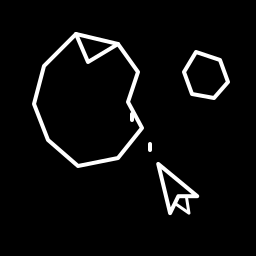

<div align="center">
  

  <h1>Asteroidz</h1>

  <p><b>A fast, modern Wayland compositor built around Vulkan.</b></p>

<a href="LICENSE"></a>

  <br/>
  <br/>

  <video src="https://github.com/user-attachments/assets/73407d39-d391-4743-826f-efc84492de28" width="720" controls muted playsinline></video>

</div>

---

Asteroidz is a Wayland compositor for Linux focused on **smoothness, visual quality, responsiveness, modern displays, and a polished desktop experience**.

It is designed for users who want a lightweight and highly responsive environment without giving up effects such as blur, shadows, rounded corners, HDR, high-refresh-rate animation, or advanced multi-monitor support.

---

## ✨ Highlights

- Native Vulkan rendering
- Smooth, presentation-aware animations
- HDR10 / PQ support
- SDR and HDR applications on the same desktop
- ICC color management
- Per-display color handling
- Background blur
- Soft directional shadows
- Rounded corners
- Borders and gradients
- Mixed-refresh-rate monitor support
- Mixed-DPI and fractional scaling
- Efficient partial rendering
- Hardware and software cursors
- Modern Wayland application support

---

## ⚡ Smooth and Responsive

Asteroidz is designed to feel immediate.

Animations are based on **time and actual display presentation**, rather than simply advancing once for every rendered frame.

This helps movement remain consistent whether a monitor is running at 60 Hz, 144 Hz, or another refresh rate.

Features include:

- Smooth workspace transitions
- Fluid window movement
- Fractional motion without visible stepping
- Interruptible animations
- Natural animation retargeting
- Position- and velocity-continuous motion
- Independent timing for monitors with different refresh rates

A missed frame does not slow the animation down or change its duration.

---

## 🚀 Vulkan Powered

Asteroidz uses a native Vulkan renderer built specifically for the compositor.

Windows, effects, backgrounds, HDR processing, and final display output are handled through the same modern rendering system.

The goal is not simply to use Vulkan.

The goal is to provide:

- Low latency
- High visual quality
- Efficient GPU usage
- Smooth high-refresh rendering
- Predictable frame delivery
- Modern HDR and color support

The Vulkan renderer is the primary rendering path.

---

## 🌈 HDR

Asteroidz supports a modern HDR desktop pipeline, including real HDR applications and video.

Current HDR capabilities include:

- HDR10 / PQ content
- 10-bit output
- Wide-gamut color
- Tone mapping
- HDR mastering information
- SDR applications on HDR displays
- HDR and SDR applications simultaneously
- Per-display HDR handling

HDR is integrated into the compositor rather than being applied as a simple final-screen filter.

This allows SDR and HDR content to be handled correctly within the same desktop.

---

## 🎨 Color Management

Different monitors reproduce color differently.

Asteroidz includes color-management support so each display can be handled according to its own capabilities.

Current functionality includes:

- ICC display profiles
- GPU color correction
- Per-monitor color configuration
- HDR display information
- Per-application color descriptions
- `frog-color-management`
- Wayland color-management support
- Automatic preferred display information for applications

Color decisions are made per display instead of assuming every connected monitor is identical.

---

## 🖥️ Multi-Monitor Support

Asteroidz treats each display independently.

Connected displays can use different:

- Resolutions
- Refresh rates
- Scaling factors
- Orientations
- HDR states
- Color profiles
- Color capabilities

For example, a setup such as:

```text
Display 1
3840×2160
144 Hz
HDR
150% scaling

Display 2
1920×1080
60 Hz
SDR
100% scaling
```

can operate without forcing both displays onto the same refresh timing, scaling model, or color configuration.

---

## 🎞️ High-Refresh Displays

High-refresh monitors are first-class citizens.

Asteroidz uses each monitor's own presentation timing rather than driving the entire desktop from one global animation clock.

This means a 144 Hz display can remain smooth while a connected 60 Hz display continues operating at its own refresh rate.

Animations remain based on elapsed time, so they do not become:

- Faster on high-refresh monitors
- Slower on low-refresh monitors
- Dependent on the number of rendered frames

---

## 🪟 Window Effects

Asteroidz includes a native set of Vulkan-powered desktop effects.

### Blur

Windows, panels, and other translucent surfaces can use real background blur.

The blur follows the actual desktop background and updates when that background changes.

Asteroidz also avoids repeatedly rebuilding expensive background blur when the source has not changed.

The result is intended to look like natural frosted glass rather than a heavily smeared or glowing image.

---

### Shadows

Windows use soft directional shadows designed to create depth without surrounding every window with a uniform glow.

The visual style favors a natural light source above the desktop, producing a broader and softer shadow underneath the window.

---

### Rounded Corners

Windows can use independently rounded corners.

Corner rendering remains correct during:

- Animation
- Fractional scaling
- Multi-monitor movement
- Different monitor scales
- Display rotation

---

### Borders

Window borders are rendered natively and remain attached cleanly to rounded window geometry.

---

### Gradients

Borders can use gradients without requiring a separate rendering path for every appearance.

---

## 🖼️ Wallpapers

Asteroidz supports wallpapers across single-monitor and multi-monitor layouts.

Background effects are derived from the wallpaper that is actually being displayed.

Changing a wallpaper automatically refreshes effects that depend on it, including background blur.

Per-display wallpaper configuration is supported according to the configured wallpaper scope.

---

## 🎮 Gaming and Media

Asteroidz is designed with modern Linux graphics workloads in mind.

It supports graphics paths commonly used by:

- Games
- Browsers
- Video players
- GPU-accelerated applications
- Wayland-native applications
- HDR media applications

HDR-aware applications can provide HDR content directly while ordinary SDR applications continue to coexist on the same desktop.

Asteroidz also supports DMA-BUF based rendering used by modern Linux applications.

---

## 🧊 Frosted and Transparent Applications

Applications using transparency can participate in the compositor's blur pipeline.

This includes applications and panels that expose partially transparent backgrounds.

Opaque applications remain opaque and do not incur unnecessary transparency or blur work.

---

## ⚙️ Efficient Rendering

Asteroidz is designed around doing only the work required for the current frame.

Examples include:

- Reusing unchanged background blur
- Avoiding rendering pixels hidden behind opaque windows
- Updating only damaged regions of the screen
- Reusing uploaded application textures when possible
- Avoiding unnecessary full-screen redraws
- Avoiding CPU waits for the GPU during normal rendering

These optimizations are especially useful for:

- 4K displays
- High refresh rates
- Multiple monitors
- Blur-heavy desktops
- Animated workspace transitions
- HDR output

---

## 💤 Idle Means Idle

When nothing on the desktop changes, Asteroidz does not continuously redraw the screen just to maintain an animation or timing loop.

No unnecessary frames are generated simply because the compositor is running.

This reduces needless GPU work and power usage while the desktop is idle.

---

## 🖱️ Cursor Support

Asteroidz supports both hardware and software cursor rendering.

The compositor automatically uses the appropriate path depending on the display and graphics environment.

---

## 🌐 Wayland

Asteroidz is a Wayland compositor.

It uses wlroots for core Linux and Wayland infrastructure while maintaining its own rendering, effects, presentation, and color-management architecture.

This provides compatibility with the wider Wayland ecosystem without limiting Asteroidz to a traditional renderer design.

---

## 🎨 Application Color Management

Applications can communicate their color characteristics to Asteroidz.

Supported paths include:

- `frog-color-management`
- `wp-color-management`

Asteroidz can provide applications with information about the display they are actually being shown on.

This matters on multi-monitor systems where one display may be HDR and another SDR, or where monitors have different color capabilities.

---

## 🐸 frog-color-management

Asteroidz directly supports `frog-color-management`.

Compatible applications can receive display information such as:

- Display primaries
- Maximum luminance
- Minimum luminance
- Maximum frame-average brightness

This information follows the display associated with the application rather than being taken from an unrelated monitor.

Applications already running are updated when relevant display state changes.

---

## 🖥️ Mixed HDR and SDR Displays

HDR does not have to be enabled globally for every monitor.

Asteroidz is designed to support systems where:

- One display is HDR
- Another display is SDR
- Applications move between them
- Each output has different color characteristics

The compositor tracks those differences per monitor.

---

## 📈 Performance Philosophy

Asteroidz favors measured improvements over complexity for its own sake.

A feature or optimization is kept when it provides a meaningful improvement in areas such as:

- Responsiveness
- Frame timing
- GPU usage
- CPU usage
- Memory bandwidth
- Power efficiency
- Visual quality
- Architectural simplicity

The project deliberately avoids adding complicated rendering techniques merely because Vulkan makes them possible.

---

## ✅ Correctness Philosophy

Visual correctness is treated as seriously as performance.

Important rendering features are tested not only by checking that they work, but also by deliberately breaking them and confirming that the tests detect the failure.

This helps avoid situations where a test reports success without actually exercising the feature it claims to verify.

The project favors:

```text
prove the feature is exercised
        ↓
break it deliberately
        ↓
verify the test fails
        ↓
restore it
        ↓
verify the test passes
```

rather than relying only on large collections of passing tests.

---

## 🚧 Project Status

Asteroidz is under active development.

Major completed areas include:

- ✅ Native Vulkan desktop rendering
- ✅ DMA-BUF support
- ✅ Partial screen updates
- ✅ Efficient shared-memory application updates
- ✅ Hardware and software cursor support
- ✅ Vulkan-to-display synchronization
- ✅ Rounded corners
- ✅ Borders
- ✅ Gradients
- ✅ Directional shadows
- ✅ Background blur
- ✅ Rendering and occlusion optimizations
- ✅ HDR10 / PQ
- ✅ Scene-linear HDR composition
- ✅ Tone mapping
- ✅ 10-bit HDR output
- ✅ Presentation-aware animation
- ✅ Mixed-refresh monitor timing
- ✅ Position- and velocity-continuous animation retargeting
- ✅ ICC color-profile support
- ✅ GPU color correction
- ✅ Per-display preferred color information
- ✅ `frog-color-management`
- ✅ Wayland color-management integration

Current development is focused on final color-management qualification and production hardening.

---

## 🛠️ Building

Asteroidz uses Meson.

Clone the repository and configure the build:

```bash
meson setup build
```

Build Asteroidz:

```bash
ninja -C build
```

For an existing build directory:

```bash
ninja -C build
```

Installation depends on your distribution and environment.

---

## 🚀 Running

The Vulkan renderer is the primary renderer.

```bash
ASTEROIDZ_RENDERER=avk asteroidz
```

Your display, input, wallpaper, appearance, and other compositor settings are controlled through the Asteroidz configuration.

---

## 🧪 Vulkan Validation

Developers debugging Vulkan behavior can enable the validation path:

```bash
ASTEROIDZ_RENDERER=avk \
ASTEROIDZ_VK_DEBUG=1 \
asteroidz
```

Validation mode is intended for debugging and testing rather than normal performance measurements.

---

## 🎯 Project Goals

Asteroidz aims to provide a Linux desktop that is:

- **Fast**
- **Smooth**
- **Responsive**
- **Visually polished**
- **Vulkan native**
- **HDR capable**
- **Color managed**
- **Efficient at high refresh rates**
- **Multi-monitor aware**
- **Comfortable on mixed-DPI setups**
- **Built around modern Linux graphics**

---

## 💡 Why Asteroidz?

Modern desktop systems increasingly combine:

- High-refresh displays
- 4K monitors
- Fractional scaling
- HDR
- Wide-gamut color
- Multiple monitors with different capabilities
- GPU-accelerated applications
- Complex transparency and visual effects

Asteroidz is designed around those requirements rather than treating them as separate features added later.

Vulkan rendering, animation timing, effects, HDR, color management, and display presentation are designed to operate as one system.

The goal is a compositor equally at home on:

- A laptop
- A multi-monitor workstation
- A high-refresh gaming setup
- A 4K desktop
- An HDR workstation
- A mixed SDR/HDR environment

---

## 🔭 Roadmap

Development continues in several areas.

### Color Management

Current work is completing qualification of:

- HDR ↔ SDR display transitions
- Application metadata updates when display state changes
- Translucent color blending
- Additional real-world multi-monitor color behavior

### Wayland Color Management

Asteroidz continues to improve compatibility with the evolving Wayland color-management ecosystem.

### Production Hardening

Future work includes continued testing of:

- Monitor hotplug
- Display mode changes
- HDR/SDR transitions
- Multi-monitor lifecycle
- Long-running sessions
- GPU buffer lifetime
- Restart and shutdown behavior
- Performance regression detection

### Future Color Features

Potential future work includes:

- Additional display-profile capabilities
- More advanced color transforms
- HLG support where useful
- Additional HDR tone-mapping options

Features are added based on real use cases rather than simply completing a checklist.

---

## 🧭 Design Principles

### Modern graphics first

Asteroidz is designed around Vulkan rather than treating Vulkan as an alternate compatibility renderer.

### Smoothness matters

Animation and presentation timing should remain consistent regardless of refresh rate.

### Displays are independent

Different monitors are allowed to have different refresh rates, scaling, HDR states, and color characteristics.

### HDR should not break SDR

Ordinary applications should continue to look correct when HDR is enabled.

### Effects should remain efficient

Blur, shadows, borders, and animations should not require wasteful full-screen rendering.

### Idle systems should remain idle

The compositor should not continuously render when nothing has changed.

### Complexity must earn its place

More sophisticated code is only worthwhile when it provides a meaningful benefit.

### Visual correctness comes first

An optimization that makes the desktop faster but visually incorrect is not an optimization.

---

## 📜 License

See the repository's `LICENSE` file for licensing information.

---

## Asteroidz

**A presentation-native, scene-linear Vulkan Wayland compositor built for modern Linux desktops.**
